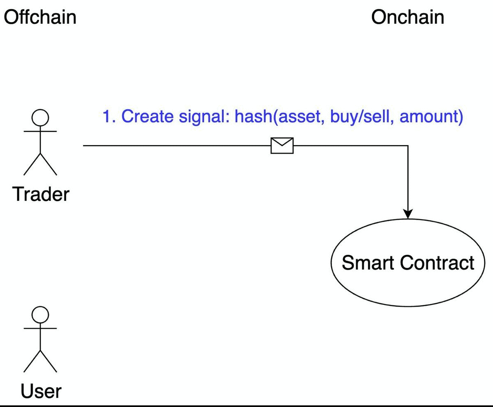

# Proof Of Trade / Clover
Zero knowledge proving system for historical performance of trader on Clover blockchain.

Demo [video](). // TODO

Testnet [page](). // TODO

Build for [Utonhack 2021 / Clover](https://utonhack-2021.devpost.com/).

## What is it
One of the most common use cases of cryptocurrency is trading. There are a lot of traders which offer their service - education, signals or delegate trading. How can a person without any trading skills distinguish real professionals from scammers and bull market gurus?

Historical performance is the only reliable metric. So a method of trade performance proving is needed. It should be trustless - is builded on blockchain to achieve this. It should be private as traders don't want to reveal their trading activity - zero knowledge proof is used to achieve it.

## How it works
There are three entities: trader, user, and on-chain program.

    

Trader path:
1. They register on the platform with their login, blockchain address and contact information. 
2. After that they can create trade signals. Trade data (ticker, amount, trade direction and nonce) is inserted by the trader, all this data is concatenated and hashed. Resulting hash is stored on the blockchain with an associated timestamp.
3. They have made such signals during some period (one month for example) and then can create trading performance proof. Zero-knowledge proofs’ SNARK protocol is used here: it proves that the trader knows preimages of signals’ hashes that correspond to the declared performance. They insert all signals preimage data (ticker, amount, trade direction and nonce - private inputs of SNARK). Local frontend downloads signals' hashes and prices on associated timestamps from blockchain (public inputs of SNARK). After that, the frontend calculates zero knowledge proof with performance percent (output of SNARK). Proof and percent are stored on blockchain too.

User can:
1. view a list of all registered traders with their aggregated statistics (trade per month, percent per month, and trader’s experience)
2. verify all percents by checking zk-proof locally on their browser
3. choose trader with the desired ratio of profits and risks
4. contact with traders in order to buy their service

External observers don't understand which signals a trader has made - it is private. 

One more important thing: all market data needed for performance calculation is taken from on-chain price oracle. So all signals’ data are stored on a chain and reliable cryptography is used for performance proving - it is trustless.

## Technical details
[Clover](https://clovernet.io/) smart contract is used as backend. All functionality and data are stored in the Clover blockchain.

Zk part of the project is implemented using [circom](https://github.com/iden3/circom) and [wasmsnark](https://github.com/iden3/wasmsnark) libraries. These libraries generate wasm prover and verifier which allow generating and verifying proofs in web browser effectively. As proofs are generated and verified off-chain it is free.

Client is the static web page which connects with the Clover blockchain using [Likelib](https://github.com/HeshuEU/likelib-hackathon).

[CoinMarketCap](https://coinmarketcap.com/api/documentation/v1/) API is used as market data source.